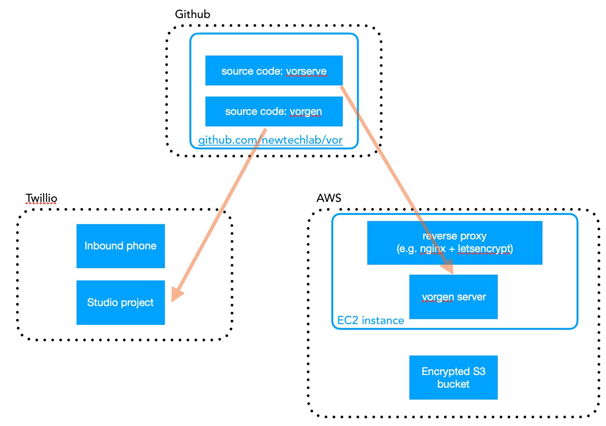

# Voice Recorder (VOR)

This is a repository containing code and description for how to set up a simple voice recording system using twillio. The intention is to make it easy to record different people talk such that training data for voice biometrics can be created.

As outlined in the diagram below it consists of the following parts:

- vorgen: a command line program (configured by a json file) that generates a Twillio Studio project setting up the appropriate system to ask questions in random order and capture the output.
- vorserve: simple server that listens to requests from Twillio studio and saves data to S3. The server implements a hashing method allowing it to store the data optionally with link back to the user phone or fully anonymized (more details below).
  

## 15 min guide to set up new recorder

It is simple to based on this project set up a new recorder, this guide assumes that you have an AWS account in which you will be running it, a Twillio account and a domain name with configurable DNS.

This is a simple guid to get it running fast - depending on usecase and required sequrity a different architecture may be advisable.

### 1. Set up AWS environment

1.  Create a new EC2 instance (micro is sufficient, run it on Ubuntu).
2.  Edit the security group such that inbound requests on 22 (from you machine) and 80 and 443 are possible.
3.  While the instance is spinning up, create a S3 bucket (enable default encryption and no public access)
4.  Create a IAM user with read and write access to the bucket, not down the credentials.

### 2. Configure DNS

1.  Configure your DNS so the domain points to the public IP of the EC2 instance.

### 3. Set up the server

1.  Install golang 1.12 or later (https://github.com/golang/go/wiki/Ubuntu) (remember to add to your PATH)
2.  go get github.com/newtechlab/vor/vorserve
3.  env AWS_ACCESS_KEY_ID=... AWS_SECRET_ACCESS_KEY=... AWS_DEFAULT_REGION=... vorserve -data s3:BUCKET-NAME-HERE -http :5000 -salt YOURSALTHERE
4.  Install nging, set up as reverse proxy to the server you started on port 5000 and require a certificate using letsencrypt. (https://medium.com/@mightywomble/how-to-set-up-nginx-reverse-proxy-with-lets-encrypt-8ef3fd6b79e5)
5.  Start server with nohup or similar (to keep it running after diskonnecting ssh) and add log dump filename:
        env AWS_ACCESS_KEY_ID=... AWS_SECRET_ACCESS_KEY=... AWS_DEFAULT_REGION=... nohup vorserve -data s3:BUCKET-NAME-HERE -http :5000 > LOG-NAME-HERE.out &)
6.  View log file with: tail -f LOG-NAME-HERE.out

### 4. Test access

1.  Test that you can access the server on https://yourdomain/ with a POST request - you should get a 400 back.

### 5. Generate Twillio project JSON

0.  (install golang 1.12 or later)
1.  go get github.com/newtechlab/vor/vorgen
1.  vorgen -dump > config.json
1.  Edit config.json to match your preferences - see more details below - in particular update the url to match your domain (include https for privacy!)
1.  vorgen > project.json

### 6. Create Twillio project (READ carefully!)

1.  Login to Twillio
2.  Goto Studio and create a new Flow. Select "Import From JSON"
3.  Copy the contents from project.json and paste here
4.  Click next
5.  Wait. Wait. Depending on configuration it can take a long time to load the editor, if you have long converstations and variations many nodes are created.
6.  BUG in twillio: After import the flow is not correctly saved, in order to work it must be re-published. In order to make it possible to re-publish you must change something, thus, in the editor:
7.  Select one box
8.  Drag it to change it's position a little bit
9.  The "Publish button" in the top is now enabled. Click it.
10. Request a new Phone number in Twillio
11. Copnfigure the phone number to invoke the Studio Flow just created on incoming phone calls.

### 7. Test

1.  Everything should now be connected, try to call the phone number, ensure that the sound file is stored in the S3 bucket.

## Explanaition of vorserve's privacy model

Twillio will call vorserve with a request containing urls to the recording as well as the phone number that made the call. All this data will be sent as part of the body. (Make sure you register a https url, and that any reverse proxy is not logging the request body).

Vorserve will store the recordings in a S3 bucket, woith names such that it is possible to identify calls that were made from the same number. However, depending on use case (consider e.g. GDPR) it may or may not be desirable to be able to link a saved file back to a particular phone number.

In order to support both cases the following logic is applied when naming the files:

    cryptographicHash(phonenumber + SALT)

Thus, if SALT is known it will be possible to identify (given a know phone number) all reccordings made from that phone number. If SALT is not known it should be impossible for anyone to match a recording to a phone numnber (thus, provided no PII in the recorded audio itself fully anonymized).

If vorserve is started without the -salt flag set it will on startup generate a unique random SALT that will not be saved, thus making the recordings anonymous. If a specific SALT is specified (using -salt) it will be used and it will thus be possible to identify a recording given a phone number.

## Further description of vorgen configuration

The vorgen config is a JSON file with fields. In order to understand what the different configuration fields mean and implies please see the source file in the repository, vorgen/config/config.go

Please note that the Twillio Studio Editor has bad performance with many nodes, and vorgen has not been optimized to decrease the numbe of nodes. In particular note that the number of nodes scales with NumberOfVariations\*Number of questions.

## TODO:

If the user hangs up instead of waiting to finish the recording will not be saved. Should be a easy fix but I do not have the time right now (but probably important to fix since I anticipate users will be bored, especially if a long conversation is desired).
